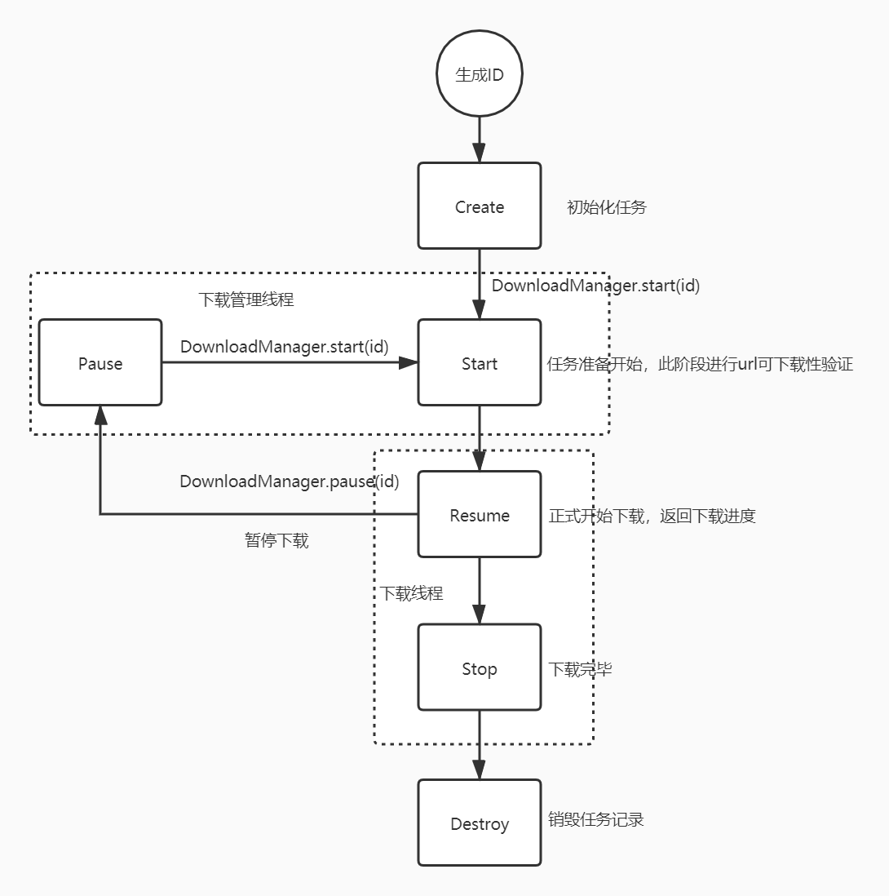

# download-master

#### 介绍
使用该框架可以通过简单配置，便可以实现文件下载及下载状态实时管理，支持断点重连、排队下载等常用功能，如果您在使用中有疑问、遇到了Bug或者有新的建议，请反馈至我的邮箱theazegm@gmail.com

#### 使用说明
- 首先引入框架
```
com.aze:okhttp-download-manager:0.1.3
```

1. 在您的Application中注册下载管理器

```kotlin
class MyApp : Application() {
    override fun onCreate() {
        super.onCreate()
        DownloadManager.init(this)
        //DownloadManager.init(this,false)  //注意：默认为按优先级下载，不需要按优先级下载时请设定byPriority参数
    }
}
```

2. 构建下载任务，返回的是下载任务的唯一IID

   **但是注意：当url、fileName、path都相同时认为是同一个任务，所以下载同一文件的不同版本时请保证三者不全都相同**

```kotlin
        val id = Task.Builder()
            .url("下载链接")    //必设项
            //.path("下载位置")         //非必设,默认下载地址在: data/data/包名/files/
            //.fileName("文件名")    //非必设,默认名称为url中的资源名
            //.priority(10)       //可以设置下载优先级,默认为10
            .build()
```

3. 设置下载观察者，进行进度管理

```kotlin
Observer.Builder(id).create(object :AbsDownloadService(){
    			//可以对全部或某个生命周期进行观察
    			override fun onStart(taskBean: TaskBean) {
                    super.onResume(taskBean)
                }
                override fun onResume(taskBean: TaskBean) {
                    super.onResume(taskBean)
                    //在此监听进度
                }
    			......
            })

//当观察者已经被创建时，可以获得该生命Observer实例，然后进行修改
//Observer.Builder(id).get().setService(mService)
```

4. 开始下载/断点重连

```
DownloadManager.start(id)
```

5. 暂停下载

```
DownloadManager.pause(id)
```

6. 销毁观察者,防止内存泄漏

```
Observer.Builder(id).get()?.destory()
```

7. 销毁下载管理器

```
DownloadManager.destroy()
```

#### 下载的生命周期


